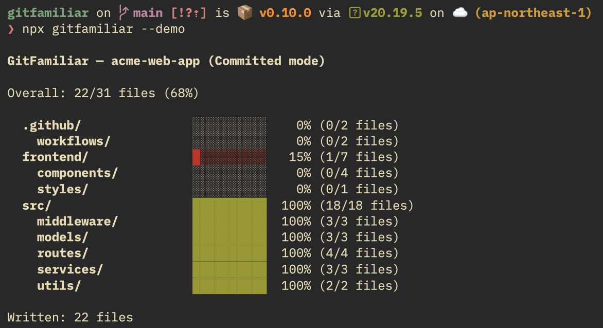
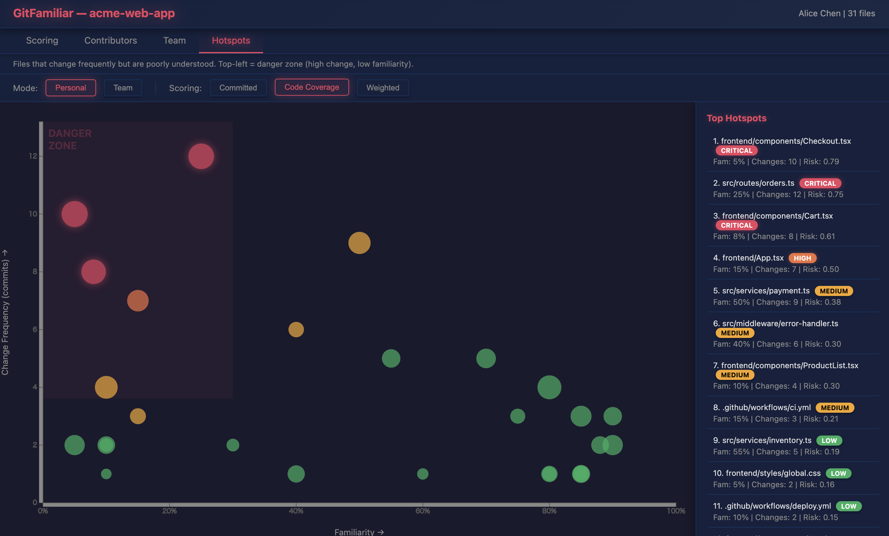

<div align="center">

# GitFamiliar

### Know your code. Not just your commits.

[](https://www.npmjs.com/package/gitfamiliar)
[](https://www.npmjs.com/package/gitfamiliar)
[](https://github.com/kuze/gitfamiliar/blob/main/LICENSE)

**Measure how well you *understand* the codebase — not just how much you wrote.**

[Quick Start](#-quick-start) · [Scoring Modes](#-scoring-modes) · [Team Features](#-team-features) · [HTML Dashboard](#-html-dashboard) · [CLI Reference](#-cli-reference)

</div>

---

Existing tools like git-fame and GitHub Contributors measure _how much_ you've written.
GitFamiliar measures something different: **how well you understand the codebase.**

Built for engineers joining a new project, it gives you and your team an objective way to track onboarding progress.

## Demo

Try it instantly without a git repository:

```bash
npx gitfamiliar --demo              # terminal output
npx gitfamiliar --demo --html       # interactive HTML dashboard
npx gitfamiliar --demo --hotspot    # hotspot analysis
npx gitfamiliar --demo --team       # team comparison
```

The demo uses a fictional project "acme-web-app" with 4 team members:

```
$ npx gitfamiliar --demo

GitFamiliar — acme-web-app (Committed mode)

Overall: 22/31 files (68%)

  .github/               ░░░░░░░░░░    0% (0/2 files)
  frontend/              █░░░░░░░░░   15% (1/7 files)
    components/          ░░░░░░░░░░    0% (0/4 files)
  src/                   ██████████  100% (18/18 files)
    routes/              ██████████  100% (4/4 files)
    services/            ██████████  100% (3/3 files)
```



Use `--html` to generate an **interactive unified dashboard** in the browser:

```bash
npx gitfamiliar --html
```

> **4 tabs** — Scoring / Coverage / Multi-User / Hotspots
> **Area** = lines of code, **Color** = familiarity (red → green)
> Click folders to drill down. Weighted mode sliders recalculate in real-time.

---

## Why GitFamiliar?

|  | git-fame / GitHub | **GitFamiliar** |
|:---|:---|:---|
| What it measures | How much you **wrote** | How well you **understand** |
| Metric | Lines / commits (cumulative) | Familiarity score (multi-signal) |
| Use case | Contribution stats | Onboarding progress |
| Time decay | No | Yes (knowledge fades) |
| Team analysis | No | Yes (bus factor, coverage, hotspots) |

---

## Quick Start

No install needed. Run inside any Git repository:

```bash
npx gitfamiliar
```

Or install globally:

```bash
npm install -g gitfamiliar
```

---

## Scoring Modes

### `committed` — default

> Best for: **New team members** tracking onboarding progress.

Files are "written" or "not written". A file counts as written if you have at least one commit touching it.

```
familiarity = written_files / total_files
```

### `code-coverage`

> Best for: **Tech leads** assessing code ownership and bus factor.

Your share of the current codebase, based on `git blame -w`.

```
score(file)    = your_blame_lines / total_lines
score(project) = sum(your_lines) / sum(all_lines)
```

```bash
gitfamiliar --mode code-coverage
```

### `weighted`

> Best for: **Power users** who want the most accurate picture.

Combines two signals with configurable weights and time decay:

```
familiarity = w1 × blame_score + w2 × commit_score
```

- **Sigmoid normalization** prevents a single large commit from dominating
- **Recency decay** (half-life: 180 days) models knowledge fading over time

```bash
gitfamiliar --mode weighted
gitfamiliar --mode weighted --weights "0.6,0.4"
```

<details>
<summary><b>Numerical example</b></summary>

File: `src/auth/login.ts` (200 lines)

```
blame_score  = 30 lines / 200 lines = 0.15

commit_score:
  commit 1 (10 days ago, +30/-0): sigmoid(30/200) × decay(10d) = 0.33 × 0.96
  commit 2 (45 days ago,  +5/-2): sigmoid(6/200)  × decay(45d) = 0.09 × 0.84
  total: min(1, 0.39) = 0.39

familiarity  = 0.5 × 0.15 + 0.5 × 0.39
             = 0.075 + 0.195
             = 0.27 → 27%
```

</details>

---

## Team Features

### Multi-User Comparison

Compare familiarity across multiple team members:

```bash
gitfamiliar --user "Alice" --user "Bob"   # specific users
gitfamiliar --team                         # all contributors
```

### Contributors Per File

Visualize bus factor — how many people know each part of the codebase:

```bash
gitfamiliar --contributors-per-file
gitfamiliar --contributors-per-file --html
```

| Risk Level | Contributors | Meaning |
|:---|:---|:---|
| **RISK** | 0–1 | Single point of failure |
| **MODERATE** | 2–3 | Some coverage |
| **SAFE** | 4+ | Well-distributed knowledge |

### Hotspot Analysis

Find files that are frequently changed but poorly understood:

```bash
gitfamiliar --hotspot                      # personal hotspots
gitfamiliar --hotspot team                 # team hotspots
gitfamiliar --hotspot --since 30           # last 30 days only
gitfamiliar --hotspot --html               # scatter plot visualization
```

> **Risk = high change frequency × low familiarity**

---

## HTML Dashboard

### Unified Dashboard (default)

Running `--html` without other feature flags generates a single-page dashboard with all features:

```bash
gitfamiliar --html                         # unified dashboard (4 tabs)
gitfamiliar --html --mode weighted         # unified, weighted as default scoring tab
```

| Tab | Visualization | Description |
|:---|:---|:---|
| **Scoring** | D3 treemap + sub-tabs | Committed, Code Coverage, Weighted modes with real-time weight sliders |
| **Contributors** | D3 treemap + risk sidebar | Contributors per file — bus factor risk analysis |
| **Team** | D3 treemap + user dropdown | Compare familiarity across all contributors |
| **Hotspots** | D3 scatter plot + sidebar | High change frequency × low familiarity = risk |




### Individual HTML Reports

```bash
gitfamiliar --html --hotspot               # hotspot scatter plot only
gitfamiliar --html --contributors-per-file # contributors treemap only
gitfamiliar --html --team                  # team comparison treemap only
gitfamiliar --html --user "Alice" --user "Bob"  # specific users comparison
```

---

## Expiration Policies

Real knowledge fades. Configure expiration to keep scores honest:

| Policy | Flag | What happens |
|:---|:---|:---|
| Never | `--expiration never` | Once written, always counted (default) |
| Time-based | `--expiration time:180d` | Expires 180 days after your last touch |
| Change-based | `--expiration change:50%` | Expires if 50%+ of the file changed since |
| Combined | `--expiration combined:365d:50%` | Expires if **either** condition is met |

> The change-based policy is the smartest: it detects when the code you wrote has been substantially rewritten, meaning your understanding is likely outdated.

---

## File Filtering

GitFamiliar automatically ignores noise — lock files, generated/minified files, build outputs, and config files.

### Custom filtering

Create a `.gitfamiliarignore` in your repo root (same syntax as `.gitignore`):

```gitignore
vendor/
third_party/
**/migrations/
```

---

## CLI Reference

```
Usage: gitfamiliar [options]

Options:
  -m, --mode <mode>              Scoring mode: committed | code-coverage | weighted (default: "committed")
  -u, --user <user>              Git user name/email (repeatable for comparison)
  -e, --expiration <policy>      Expiration: never | time:Nd | change:N% | combined:Nd:N%
      --html                     Generate HTML report (alone = unified dashboard)
  -w, --weights <w1,w2>          Weights for weighted mode (must sum to 1.0)
      --team                     Compare all contributors
      --contributors-per-file    Analyze contributors per file (bus factor)
      --hotspot [mode]           Hotspot analysis: personal (default) or team
      --since <days>             Hotspot analysis period in days (default: 90)
      --demo                     Show demo with sample data (no git repo needed)
  -V, --version                  Output version number
  -h, --help                     Display help
```

---

## Programmatic API

```typescript
import { computeFamiliarity } from 'gitfamiliar';

const result = await computeFamiliarity({
  mode: 'committed',
  expiration: { policy: 'never' },
  weights: { blame: 0.5, commit: 0.5 },
  html: false,
  repoPath: '/path/to/repo',
});

console.log(`Score: ${Math.round(result.tree.score * 100)}%`);
```

---

## Requirements

- **Node.js** >= 18
- **Git** (available in PATH)

## Contributing

Contributions are welcome! Please open an issue first to discuss what you'd like to change.

```bash
git clone https://github.com/kuze/gitfamiliar.git
cd gitfamiliar
npm install
npm run build
npm test
```

## Roadmap

- [ ] Dependency Awareness — factor in understanding of imported files
- [ ] VS Code Extension — see familiarity scores inline in the editor
- [ ] README Badge — Codecov-style badge for your project README

## License

[MIT](LICENSE)
